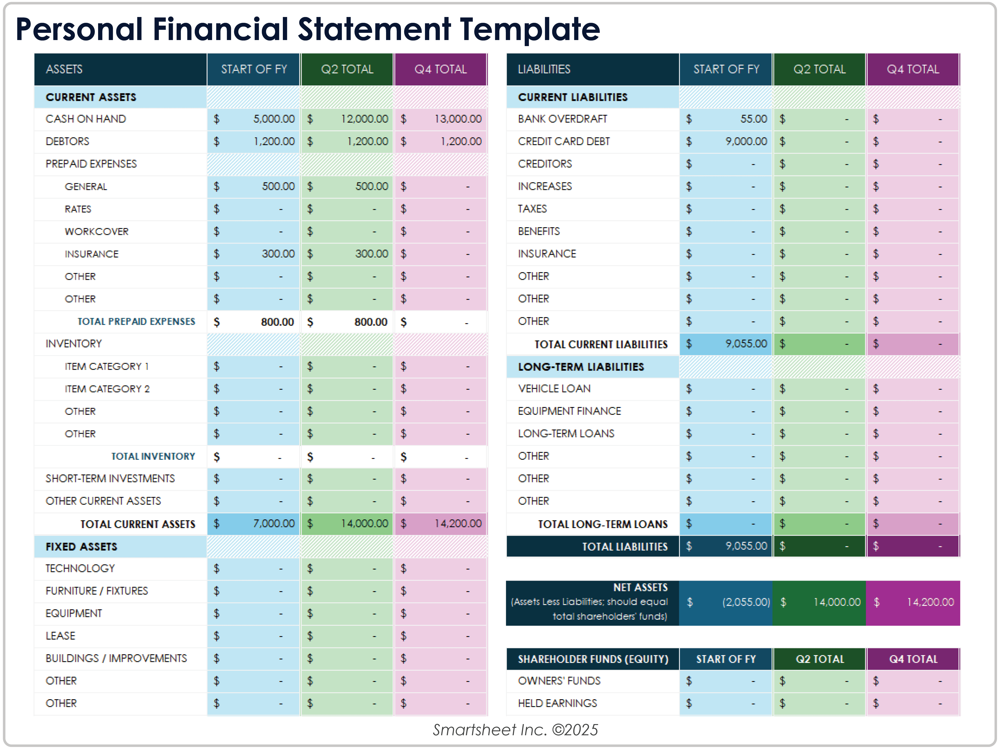
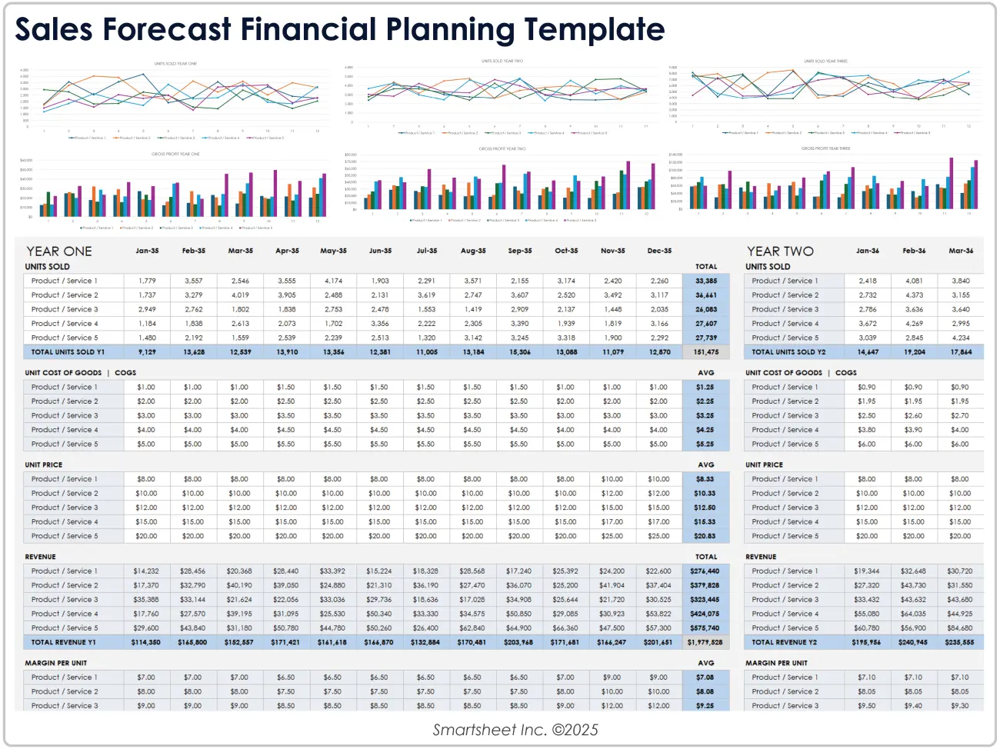
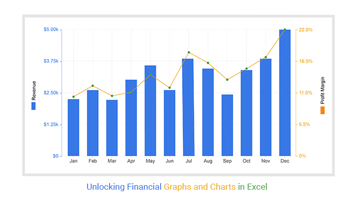

# 💸 FinTrack – Personal Financial Dashboard

## 📝 Description

**FinTrack** is a modern financial website that helps users manage their income, expenses, budgets, and investments all in one place. It provides a clean dashboard, charts for financial analysis, and integrates real-time financial data from external APIs.

---

## 🛠️ Technologies Used

### 🔧 Frontend
- React.js
- React Router
- Axios
- Bootstrap / Tailwind CSS

### 🖥️ Backend
- Node.js
- Express.js

### 🗄️ Database
- MongoDB (with Mongoose)

### 🔐 Authentication & Security
- JSON Web Tokens (JWT)
- bcrypt for password encryption
- Helmet.js for HTTP security

### 📡 APIs
- Alpha Vantage API / Yahoo Finance API (for market data)


## 📸 Screenshots







## 📦 Installation Instructions
```bash
git clone https://github.com/yourusername/fintrack.git
cd fintrack

cd server
npm install

cd ../client
npm install

cd ../server
npm run dev

cd ../client
npm start
```

## 🚀 Usage

1. Open your browser and go to `http://localhost:3000`
2. Register a new user account or log in
3. Add income and expense entries
4. View summaries, charts, and investment updates
5. Analyze your financial health on the dashboard

## ✨ Features

* User registration & login with JWT auth
* Add, edit, and delete transactions
* Set monthly budgets and track against expenses
* View real-time stock/crypto market data
* Interactive charts with Chart.js
* Fully mobile-responsive UI

---

## 👥 Contributors

  Full Stack Developer

## 📄 License
This project is licensed under the **MIT License** – see the [LICENSE](LICENSE) file for details.


